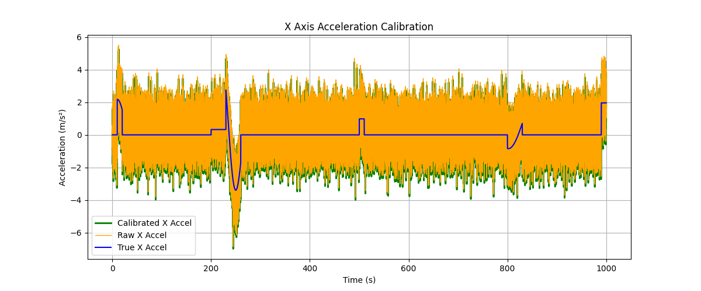
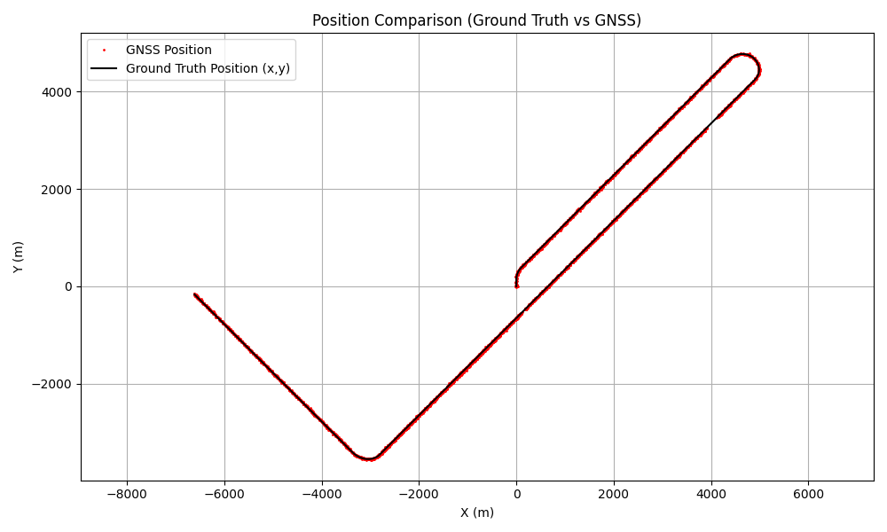
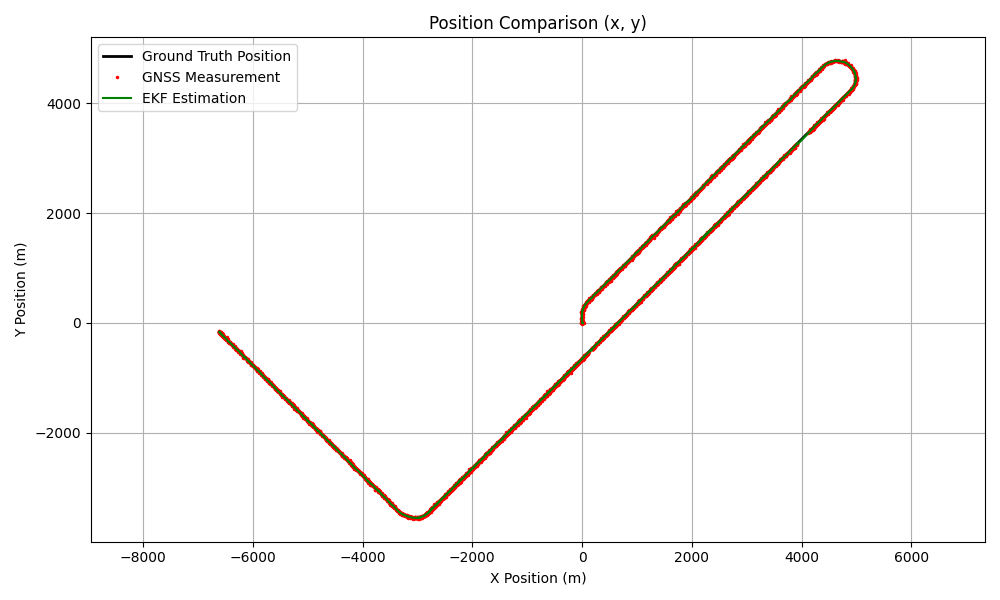
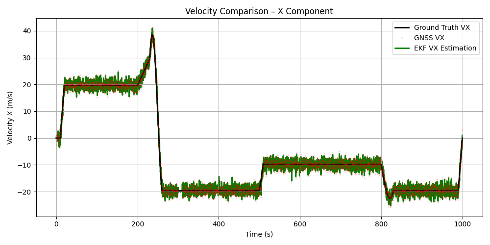
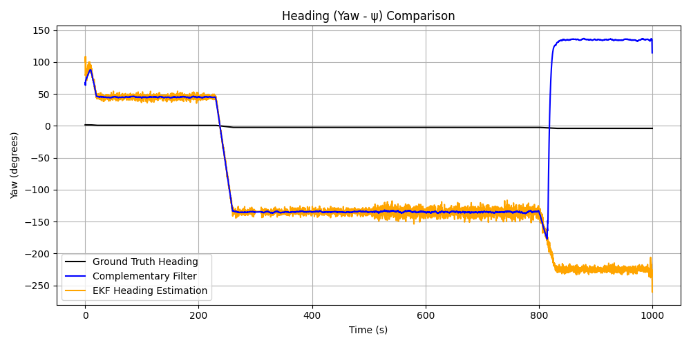
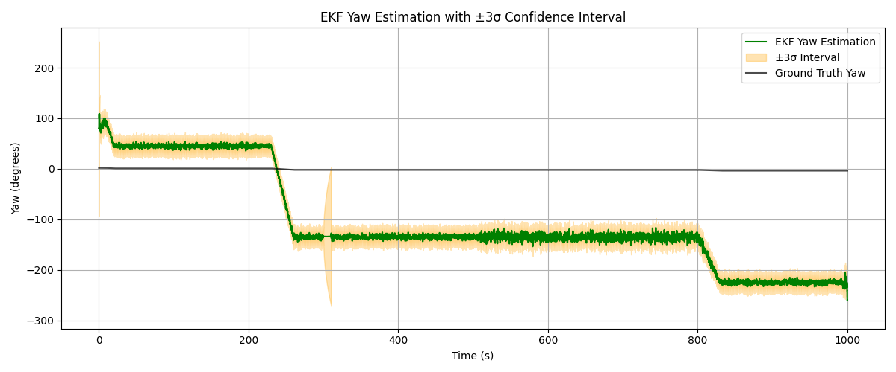

# SensorFusion

**Sensor Fusion and State Estimation Graduation Project.**
This project implements vehicle motion simulation, IMU and GNSS sensor models, disturbances, calibration, and filtering techniques (Average, Low-Pass, Complementary, Extended Kalman Filter) for state estimation.

---

## 📌 Project Steps

1. **Vehicle Motion Simulation**  
   - Vehicle’s position, velocity, and orientation are obtained using Euler integration along the predefined 10-phase route.

2. **Sensor Modeling**  
   - **IMU:** Accelerometer + Gyroscope (50 Hz). Includes noise, bias, and scale factor errors.
   - **GNSS:** Position + Velocity (5 Hz). Includes noise and a 200 ms latency delay.

3. **GNSS Disturbances**  
   - **300–310 s:** Signal outage (no GNSS data).
   - **400 s:** 500 m position error jump (lasting 1 s).
   - **500–505 s:** Frozen data (flatline).
   - These scenarios are used to analyze the robustness and performance of the implemented filters.

4. **Sensor Calibration**  
   - IMU bias and scale factor errors are estimated and corrected.

5. **Filtering Techniques**  
   - **Averaging:** Simple fusion of sensor outputs.
   - **Low-Pass Filter:** IIR filter applied to IMU data.
   - **Complementary Filter:** Fusion of IMU gyroscope and GNSS heading data.
   - **Extended Kalman Filter (EKF):** 4-state Unicycle kinematic model for position, velocity, and heading estimation.

6. **Visualization**  
   - Comparative plots for Position, Velocity, Heading, Acceleration, and Angular Velocity.
   - EKF covariance tracking and error bounds (±3σ).

---

## 📊 Visualizations & Results

### 1. Sensor Calibration
Demonstrates the successful correction of bias and scale factor errors from the raw IMU data.

### 2. Ground Truth vs GNSS Measurements
Shows the simulated vehicle route and the noisy GNSS measurements with disturbances (outages, jumps, freezes).

### 3. Extended Kalman Filter (EKF) Position Estimation
Shows how the EKF smoothly estimates the true trajectory, rejecting the 500m GNSS jump and handling the signal outage.

### 4. Velocity (VX) Estimation
Compares the noisy GNSS velocity measurements with the smoothed EKF velocity estimation.

### 5. Heading (Yaw) Estimation
Compares the Complementary Filter and EKF performance against the Ground Truth heading.

### 6. EKF Confidence Bounds (±3σ)
Illustrates the EKF yaw estimation along with its theoretical 3-sigma confidence interval tracking the true state.

---

## 📂 File Structure

- `01_route.py` → Vehicle motion and route simulation.
- `02_sensor_model.py` → IMU and GNSS sensor data generation.
- `03_calibration.py` → Sensor calibration and error correction.
- `04_filter_average.py` → Average filtering.
- `05_filter_lowpass.py` → Low-pass filtering.
- `06_filter_complementary.py` → Complementary filter implementation.
- `07_filter_ekf.py` → Extended Kalman Filter (EKF) implementation.
- `08_visualization.py` → Final comparative plots and analysis generation.
- `*.npz` → Intermediate simulation data storage.
- `*.png` → Generated plots and visualizations.

---

**Note:** This project is the Graduation Assignment for the Autonomous Driving Technologies Specialization Program.

**Developer:** Mert Naci Akalın
